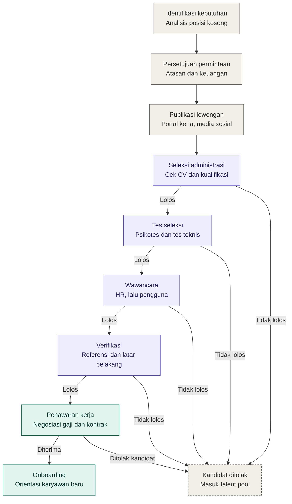

# Alur Rekrutmen Karyawan Baru

```mermaid
flowchart TD
    A[Identifikasi kebutuhan<br/>Analisis posisi kosong] --> B[Persetujuan permintaan<br/>Atasan dan keuangan]
    B --> C[Publikasi lowongan<br/>Portal kerja, media sosial]
    C --> D[Seleksi administrasi<br/>Cek CV dan kualifikasi]
    D -->|Lolos| E[Tes seleksi<br/>Psikotes dan tes teknis]
    E -->|Lolos| F[Wawancara<br/>HR, lalu pengguna]
    F -->|Lolos| G[Verifikasi<br/>Referensi dan latar belakang]
    G -->|Lolos| H[Penawaran kerja<br/>Negosiasi gaji dan kontrak]
    H -->|Diterima| I[Onboarding<br/>Orientasi karyawan baru]

    D -->|Tidak lolos| X[Kandidat ditolak<br/>Masuk talent pool]
    E -->|Tidak lolos| X
    F -->|Tidak lolos| X
    G -->|Tidak lolos| X
    H -->|Ditolak kandidat| X

    classDef prep fill:#F1EFE8,stroke:#5F5E5A,color:#2C2C2A
    classDef seleksi fill:#EEEDFE,stroke:#534AB7,color:#26215C
    classDef final fill:#E1F5EE,stroke:#0F6E56,color:#04342C
    classDef reject fill:#F1EFE8,stroke:#5F5E5A,stroke-dasharray:4 3,color:#2C2C2A
    class A,B,C prep
    class D,E,F,G seleksi
    class H,I final
    class X reject
```
